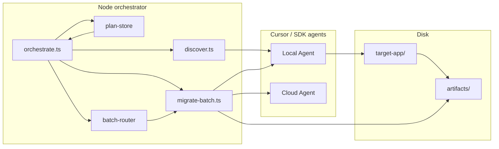

# Data & control flow (review notes)

How information moves through the migration demo: **orchestrator** (Node + `@cursor/sdk`), **Cursor project config** (rules, subagents, hooks), and **artifacts** on disk.

---

## Big picture

- **Orchestrator** is plain TypeScript: it calls the SDK, reads/writes files under `artifacts/`, and prints to the terminal.
- **Rules / subagents / hooks** apply when a **Cursor agent** (local or cloud) works inside the repo with **project** settings—they are *not* imported by the orchestrator’s Node process.

---

## 1. Orchestrator entry (`orchestrator/orchestrate.ts`)

| Stage | Input | Output |
|--------|--------|--------|
| CLI flags | `process.argv` (`--cloud`, `--batch`, `--discover-only`, `--only <path>`) | Mode switches |
| Paths | `process.cwd()`, fixed `target-app/` | `targetCwd` |
| Cloud config | `MIGRATION_DEMO_REPO_URL`, `MIGRATION_DEMO_BASE_REF` (default `main`), `CURSOR_API_KEY` | Cloud clone target + auth |

**Flow:**

1. **Discovery** → produces a `MigrationPlan`-shaped object (in memory).
2. **Sort** plan items by complexity (trivial → … → dynamic-format).
3. **Optional `--only`** → filter plan items to one path (or unique basename).
4. **`writePlan`** → `artifacts/migration-plan.json` + `artifacts/migration-plan.md`.
5. If **`--discover-only`** → stop.
6. **`readPlan`** → reload JSON (single source of truth for the run).
7. **Batching** → either one item per work unit, or `groupIntoBatches` when `--batch`.
8. **Loop** → for each work unit, `runMigrationWorkUnit` (see below).
9. **Cloud:** create **one** shared `Agent` up front, pass it into every unit; **dispose** at end.
10. **Summary** → console via `dashboard.ts` (`printRunSummary`).

---

## 2. Discovery (`orchestrator/discover.ts`)

**Purpose:** Turn the codebase into a list of files to migrate.

| Mode | Mechanism | Input | Output |
|------|-----------|--------|--------|
| With `CURSOR_API_KEY` | `Agent.create({ local: { cwd: targetCwd, settingSources: ["project"] } })` + prompt | `targetCwd` | `MigrationPlan` |
| Without API key | Read fixed candidate paths, grep for `moment` | Files under `target-app/` | `MigrationPlan` |

**`MigrationPlan`:**

- `generatedAt`, `source` (directory)
- `items: MigrationItem[]` where each item has:
  - `file` — repo-relative path under `target-app` (e.g. `src/lib/trivial.ts`)
  - `complexity` — inferred from path heuristics (`hard` → `timezone`, `medium` → `mutation-aware`, else `trivial`)
  - `reason` — short human-readable string

Discovery **does not** call cloud; it is always **local** agent or **offline** scan.

---

## 3. Plan persistence (`orchestrator/plan-store.ts`)

| File | Contents |
|------|----------|
| `artifacts/migration-plan.json` | Full `MigrationPlan` (machine-readable) |
| `artifacts/migration-plan.md` | Table for humans |

After `writePlan`, **`readPlan()`** only reads the JSON. That keeps “what we will run” aligned with what was written, even if you later extend the pipeline.

---

## 4. Batch routing (`orchestrator/batch-router.ts`)

Used only when **`--batch`**:

- **Easy batch:** `trivial`, `format-only`, `mutation-aware`
- **Hard batch:** `timezone`, `dynamic-format`
- Anything else → own batch

**Data out:** `MigrationItem[][]` — each inner array is one **agent `send`** (one branch/PR for that batch in cloud mode).

---

## 5. Migration execution (`orchestrator/migrate-batch.ts`)

**Input per call:**

- `MigrationItem` or `MigrationItem[]` (batch)
- `BatchOptions`: `cloudMode`, `cloudRepoUrl`, `cloudBaseRef`
- Optional **`sharedAgent`** (cloud reuse from `orchestrate.ts`)

**Behavior:**

- Builds a **text prompt** (branch name, PR title, file list, “follow moment-to-datefns rule”, subagent flow, expected final lines for status/summary/PR URL).
- **`Agent.create`** if no shared agent (local: `cwd: targetCwd`; cloud: repo URL + `startingRef`, `autoCreatePR`).
- **`agent.send(prompt)`** → **`run.wait()`** (with heartbeats in `run-telemetry.ts`).
- Parses agent reply heuristically (`human-review` / `failed` / else `passed`).
- Reads **`result.git`** for PR URL when present.

**Output per file:** `BatchRunResult` — `item`, `status`, `summary`, optional `branchName`, `prUrl`, `logPath`.

**Artifacts:**

- `artifacts/runs/*.md` — raw-ish agent response text per run.

---

## 6. Telemetry & UI (`orchestrator/run-telemetry.ts`, `dashboard.ts`)

- **Phases:** `logPhaseStart` / `logPhaseEnd` with durations and small metadata objects.
- **Heartbeats:** while waiting on SDK `wait()`, periodic log lines so long cloud waits look alive.
- **Dashboard:** colored terminal lines for plan rows and per-file results (no separate data store).

---

## 7. Cursor rules (policy text, not executed by Node)

**File:** `.cursor/rules/moment-to-datefns.mdc`

- **Globs:** `target-app/**/*.{ts,tsx,js,jsx}`
- **Role:** When an agent has **project** context, Cursor attaches this policy so edits follow the mapping table, safety rules, tz guidance, etc.

**Data flow:** Orchestrator prompts say “follow the rule”; the **agent runtime** pulls the rule content into the model context. The orchestrator never parses `.mdc` itself.

---

## 8. Subagents (`.cursor/agents/*.md`)

Files: `migrator.md`, `validator.md`, `reviewer.md`.

- Referenced in migration prompts as a **workflow** (“migrator → validator → reviewer”).
- Interpreted by **Cursor** when the agent delegates or follows project agent definitions—not by the orchestrator binary.

---

## 9. Hooks (IDE enforcement on edits)

**Config:** `.cursor/hooks.json` registers:

- **`afterFileEdit`** → `.cursor/hooks/block-moment-import.sh`

**What runs:** When Cursor is about to apply an edit, it invokes the hook with a **JSON payload** on stdin.

**`block-moment-import.sh` logic:**

1. Parse `toolCall.input.target_file` from the payload.
2. If file missing → allow (`exit 0`).
3. If file contains `migration-allow-moment:` → allow (escape hatch).
4. If file matches Moment `import` / `require` → **deny** with JSON `permission: deny` and a message (`exit 2`).
5. Else allow.

**Important:** Hooks affect **interactive/agent file edits in Cursor**. They do **not** run when you `git commit`, `npm test`, or when the orchestrator process writes files—unless that write path goes through Cursor’s edit pipeline.

---

## 10. `target-app/` vs cloud clone

| Mode | Where the migration agent edits |
|------|----------------------------------|
| Local (`npm run migrate`) | Your working tree: `target-app/` |
| Cloud (`--cloud`) | Clone of `MIGRATION_DEMO_REPO_URL` at `MIGRATION_DEMO_BASE_REF` |

Discovery for the plan still uses **local** `target-app/` when using the SDK discovery path. For cloud demos, keep **remote `main` (or your base ref)** consistent with what you expect to migrate.

---

## 11. Quick reference: who reads what

| Consumer | Reads |
|----------|--------|
| `orchestrate.ts` | argv, env, `migration-plan.json` (after write) |
| `discover.ts` | `target-app/` sources (agent or grep) |
| `migrate-batch.ts` | `MigrationItem(s)`, env for cloud URL/ref |
| Cursor agent | `.cursor/rules`, `.cursor/agents`, `target-app` or cloud repo |
| Hook script | stdin JSON + edited file on disk |

---

## 12. Optional follow-up docs

- `CLOUD_SETUP.md` — env vars and GitHub wiring.
- `DEMO_SCRIPT.md` — spoken beats for a live run.
- `PRESENTATION.md` — stakeholder narrative.

This file is **internal**: accurate to the codebase layout above; adjust if you rename paths or add new hooks.
