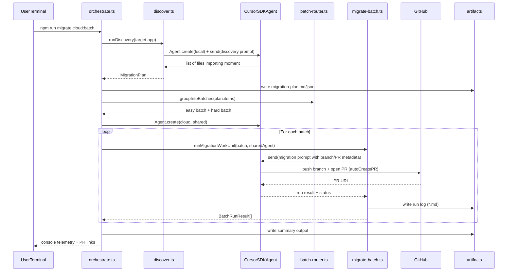

# Cursor Automation Prototype
## Migration Agent for Enterprise Codebases

---

## 1) Title

**From Stalled Tech Debt to Repeatable Migration System**

- Prototype: Moment.js -> date-fns migration harness
- Built with Cursor SDK + Rules + Hooks + Cloud PR automation
- Goal: improve velocity, reduce cognitive load, increase safety

---

## 2) Business Problem

**Enterprise migrations stall for years**

- Hundreds of usage sites across services/modules
- Low feature priority, high coordination overhead
- Manual migration is repetitive and error-prone
- Teams fear silent regressions (timezones, date formatting, mutability)

---

## 3) Why It Matters (Business Impact)

**Unfinished migrations create compounding cost**

- Slower developer velocity (context switching + repetitive PRs)
- Higher operational risk (inconsistent date logic in prod paths)
- Increased maintenance burden (deprecated library footprint)
- Ongoing dependency/security and bundle-size drag

---

## 4) Current State vs Target State

**Before**

- Migration treated as one-off project
- No reusable policy for transformations
- No enforcement preventing reintroduction

**After**

- Migration treated as repeatable system capability
- Policy-as-code for deterministic guidance
- Automated PR generation + enforcement ratchet

---

## 5) Proposed Solution

**Migration Agent Harness**

1. Discover and classify migration candidates
2. Route files by risk (easy vs hard)
3. Execute migration runs with Cursor agents
4. Open PRs automatically (cloud mode)
5. Persist artifacts and enforce no-regression policy

---

## 6) System Components

- `target-app/`: representative app with Moment usage patterns
- `.cursor/rules/moment-to-datefns.mdc`: migration policy and safety constraints
- `.cursor/agents/*`: migrator, validator, reviewer roles
- `.cursor/hooks.json` + script: block new Moment imports
- `orchestrator/*`: SDK-driven discovery, routing, run execution, telemetry
- `artifacts/*`: migration plan, run logs, summary for auditability

---

## 7) Workflow (End-to-End)

1. Discovery scans files importing Moment
2. Complexity labeling: trivial / mutation-aware / timezone / dynamic-format
3. Smart policy routing:
   - Easy batch: trivial + medium
   - Hard batch: timezone/dynamic-format
4. Shared cloud agent executes runs and opens PRs
5. Test and review results captured in artifacts

---

## Sequence Diagram

---

## 8) Demo Walkthrough (30 mins)

- Problem framing + baseline (imports + tests + bundle signal)
- Show policy rule file (safety and transformation logic)
- Run orchestrator (`npm run migrate:cloud:batch`)
- Watch telemetry + heartbeat (no “hung” perception)
- Open generated PR(s) and review diff quality
- Show artifacts + summary output
- Close with impact and rollout plan

---

## 9) Value Delivered

**Developer Velocity**

- Fewer manual edits and repetitive PR tasks
- Batch routing reduces round-trips and cycle time

**Cognitive Load**

- Policy captures transformation rules once
- Engineers review focused PRs rather than hand-migrating every file

**Code Quality / Safety**

- Hard cases isolated for stricter review
- Hook prevents regression after migration
- Artifacts provide traceability

---

## 10) Risks and Tradeoffs

- Cloud run latency (mitigated by shared agent + heartbeat logs)
- Repeat demo branch collisions (mitigated with branch cleanup/reset)
- Agent ambiguity on hard semantic cases (mitigated by human-review path)
- Depends on integration/auth setup (Cursor key + GitHub connection)

---

## 11) Rollout Plan (Enterprise)

**Phase 1: Pilot**

- 1 repository, 1 migration rule, 2-3 batches

**Phase 2: Platformization**

- Standardized rule template
- CI scheduled runs and reporting
- Service-account-based credentials

**Phase 3: Scale**

- Reuse harness across migrations (internal SDK v1->v2, test framework updates)
- Team-level governance + policy versioning

---

## 12) Success Metrics

- Time-to-migrate target modules
- Number of usage sites removed per run
- PR throughput and review cycle time
- Post-migration reintroduction rate (should trend to zero)
- Bundle-size or dependency footprint reduction

---

## 13) What's Next

**Near-term moves after this prototype**

- **Metrics & baseline:** capture usage sites, bundle, and test runtime before the next pilot batch
- **Pilot validation:** run a scoped cloud demo (`--only` / `migrate:cloud:one`) to stress PR quality and review load
- **Operations:** publish an operator runbook (env vars, base branch, branch/PR cleanup, artifact retention)
- **Rollout:** schedule a second pilot slice (one service or package) with the same rule pack
- **Enablement:** point teams at the hook + policy so new Moment usage cannot slip back unnoticed

---

## 14) Future Extensions

**Where the harness could go next**

- **Jira / Linear:** human-review queue, labels, and assignees from plan complexity; auto-link PRs to migration epics; transition tickets when PR merges or fails
- **GitHub Issues:** issue references, project fields, and milestones tied to batch scope; same linkage patterns as above where the org lives on GitHub
- **Slack:** webhooks for batch completion, human-review backlog depth, and run failures
- **Docs:** Confluence or Notion pages generated from `artifacts/` (plan, runs, summary) for leadership and audit readers

---

## 15) Ask / Closing

**This prototype demonstrates a reusable enterprise workflow**

- Not just “AI code generation,” but governed automation
- Policy + orchestration + enforcement + audit trail
- Immediate value for recurring migration debt

**Next step:** productionize as an internal migration service with CI triggers.

